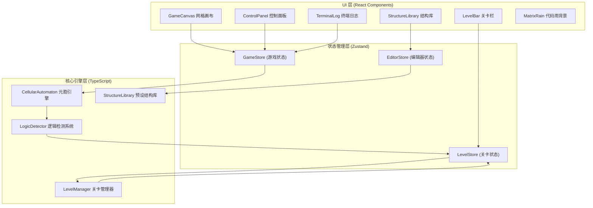

## 1. 架构设计



## 2. 技术描述

- **前端**：React 18 + TypeScript + TailwindCSS 3 + Vite 5
- **状态管理**：Zustand (轻量级，适合游戏状态)
- **渲染**：Canvas 2D API (高性能网格渲染)
- **元胞引擎**：Uint8Array 双缓冲技术，位运算优化邻居计数
- **初始化工具**：`pnpm create vite@latest`

### 核心性能优化策略
1. **TypedArray 存储**：使用 `Uint8Array` 存储细胞状态，`Uint32Array` 存储邻居计数
2. **双缓冲机制**：current/next 两个缓冲区交替使用，避免频繁内存分配
3. **边界优化**：使用 1px 边界填充，避免边界条件判断
4. **Canvas 批量绘制**：一次性绘制所有活细胞，减少 draw call
5. **requestAnimationFrame 节流**：根据速度调节演化帧率

## 3. 目录结构

```
src/
├── components/          # React 组件
│   ├── GameCanvas.tsx          # 主游戏画布
│   ├── ControlPanel.tsx        # 控制面板
│   ├── StructureLibrary.tsx    # 结构库面板
│   ├── LevelBar.tsx            # 关卡进度栏
│   ├── TerminalLog.tsx         # 终端日志
│   └── MatrixRain.tsx          # 代码雨背景
├── engine/              # 核心引擎
│   ├── CellularAutomaton.ts    # 元胞自动机引擎
│   ├── structures/             # 预设结构定义
│   │   ├── gliders.ts          # 滑翔机系列
│   │   ├── guns.ts             # 滑翔机枪
│   │   ├── gates.ts            # 逻辑门模板
│   │   └── index.ts
│   ├── LogicDetector.ts        # 逻辑门检测系统
│   └── LevelManager.ts         # 关卡管理器
├── store/               # 状态管理
│   ├── useGameStore.ts         # 游戏状态
│   ├── useLevelStore.ts        # 关卡状态
│   └── useEditorStore.ts       # 编辑器状态
├── types/               # 类型定义
│   ├── cell.ts
│   ├── level.ts
│   └── structure.ts
├── utils/               # 工具函数
│   ├── canvas.ts             # Canvas 绘制工具
│   └── terminal.ts           # 终端日志格式化
├── App.tsx
├── main.tsx
└── index.css
```

## 4. 核心数据模型

### 4.1 元胞自动机引擎

```typescript
// 细胞状态
type CellState = 0 | 1;  // 0=死亡, 1=存活

class CellularAutomaton {
  private width: number;
  private height: number;
  private current: Uint8Array;  // 当前状态 (width+2) * (height+2)
  private next: Uint8Array;     // 下一状态
  private neighborCounts: Uint32Array;  // 邻居计数缓存

  constructor(width: number, height: number);
  step(): void;  // 演化一步
  getCell(x: number, y: number): CellState;
  setCell(x: number, y: number, state: CellState): void;
  clear(): void;
  randomize(density: number): void;
  placeStructure(structure: Structure, x: number, y: number): void;
}
```

### 4.2 预设结构

```typescript
interface Structure {
  id: string;
  name: string;
  description: string;
  category: 'glider' | 'gun' | 'gate' | 'utility';
  pattern: number[][];  // 2D 数组，1=活细胞
  width: number;
  height: number;
  period?: number;  // 周期（如果是振荡器/发射器）
}
```

### 4.3 关卡系统

```typescript
interface Level {
  id: number;
  name: string;
  description: string;
  objective: string;
  availableStructures: string[];  // 可用结构ID列表
  inputs: DetectionPoint[];       // 输入检测点
  outputs: DetectionPoint[];      // 输出检测点
  truthTable: TruthTableEntry[];  // 期望真值表
  gridSize: { width: number; height: number };
}

interface DetectionPoint {
  id: string;
  x: number;
  y: number;
  label: string;
  type: 'input' | 'output';
}

interface TruthTableEntry {
  inputs: Record<string, 0 | 1>;
  expectedOutputs: Record<string, 0 | 1>;
}
```

### 4.4 状态管理

```typescript
interface GameState {
  isRunning: boolean;
  speed: number;  // 每秒演化步数 1-60
  generation: number;
  population: number;
  grid: Uint8Array;
  controls: {
    play: () => void;
    pause: () => void;
    step: () => void;
    reset: () => void;
    setSpeed: (speed: number) => void;
  };
}
```

## 5. 核心算法

### 5.1 元胞自动机演化算法 (TypedArray 优化)

```typescript
step(): void {
  // 使用 Uint32Array 批量计算邻居
  const { width, height, current, next, neighborCounts } = this;
  const stride = width + 2;

  // 1. 清零邻居计数
  neighborCounts.fill(0);

  // 2. 遍历内部细胞，累加邻居计数
  // 使用 TypedArray 的连续内存访问特性优化缓存命中率
  for (let y = 1; y <= height; y++) {
    for (let x = 1; x <= width; x++) {
      const idx = y * stride + x;
      if (current[idx] === 1) {
        // 对 8 个邻居累加
        neighborCounts[idx - stride - 1]++;
        neighborCounts[idx - stride]++;
        neighborCounts[idx - stride + 1]++;
        neighborCounts[idx - 1]++;
        neighborCounts[idx + 1]++;
        neighborCounts[idx + stride - 1]++;
        neighborCounts[idx + stride]++;
        neighborCounts[idx + stride + 1]++;
      }
    }
  }

  // 3. 应用 Conway 规则更新 next 状态
  for (let y = 1; y <= height; y++) {
    for (let x = 1; x <= width; x++) {
      const idx = y * stride + x;
      const count = neighborCounts[idx];
      const alive = current[idx] === 1;
      
      // 规则：存活且2-3邻居 → 继续存活；死亡且3邻居 → 复活
      next[idx] = (alive && (count === 2 || count === 3)) || (!alive && count === 3) ? 1 : 0;
    }
  }

  // 4. 交换缓冲区（只需交换指针，零拷贝）
  [this.current, this.next] = [this.next, this.current];
  this.generation++;
}
```

### 5.2 逻辑门检测算法

通过在指定位置检测滑翔机的通过来确定逻辑值：
- 在输入点注入信号（放置滑翔机表示 1，不放置表示 0）
- 在输出点设定检测窗口，统计该区域在 N 个世代内的活细胞数
- 超过阈值判定为 1，否则为 0
- 遍历真值表所有组合验证功能正确性

## 6. 预设结构库内容

| 结构ID | 名称 | 分类 | 说明 |
|--------|------|------|------|
| `glider` | 滑翔机 | glider | 最基础的移动结构，周期4 |
| `lwss` | 轻型太空船 | glider | 更快的移动结构，周期4 |
| `mwss` | 中型太空船 | glider | 周期4 |
| `hwss` | 重型太空船 | glider | 周期4 |
| `gosper_gun` | 高斯帕滑翔机枪 | gun | 每30代发射一个滑翔机 |
| `simkin_glider_gun` | Simkin 滑翔机枪 | gun | 更高周期的滑翔机枪 |
| `eater1` | 吞噬者1号 | utility | 可吞噬滑翔机，用于信号控制 |
| `reflector` | 反射器 | utility | 90度反射滑翔机 |
| `splitter` | 分裂器 | utility | 将一个滑翔机分裂为两个 |
| `not_gate` | NOT门模板 | gate | 非门预制结构 |
| `and_gate` | AND门模板 | gate | 与门预制结构 |
| `or_gate` | OR门模板 | gate | 或门预制结构 |
