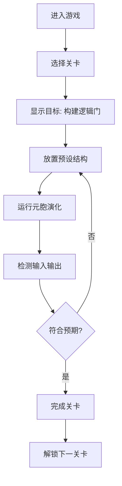

## 1. 产品概述

一款基于 Conway 生命游戏元胞自动机的逻辑电路沙盒游戏。玩家通过放置滑翔机、滑翔机枪等特殊结构，在网格上演化出 AND、OR、NOT 等逻辑门，最终构建半加器、全加器等计算单元来通过关卡。

- 面向极客、计算机科学爱好者、游戏玩家
- 将理论计算机科学与游戏化结合，寓教于乐
- 终端黑客风格的视觉体验，营造沉浸式代码瀑布氛围

## 2. 核心功能

### 2.1 用户角色

| 角色 | 注册方式 | 核心权限 |
|------|----------|----------|
| 玩家 | 无需注册 | 自由编辑网格、放置预设结构、挑战关卡 |

### 2.2 功能模块

1. **主界面**：元胞自动机网格、控制面板、结构库、关卡进度
2. **元胞引擎**：基于 TypedArray 的高效生命游戏演化引擎
3. **结构系统**：滑翔机、高斯帕滑翔机枪、逻辑门预设结构库
4. **关卡系统**：从基础逻辑门到全加器的递进式关卡
5. **检测系统**：实时检测玩家构建的逻辑电路功能

### 2.3 页面详情

| 页面名称 | 模块名称 | 功能描述 |
|----------|----------|----------|
| 主游戏界面 | 网格画布 | 可交互的元胞网格，支持点击编辑、拖拽放置结构 |
| 主游戏界面 | 控制面板 | 播放/暂停、步进、速度调节、清空、随机生成 |
| 主游戏界面 | 结构库面板 | 可拖拽的预设结构列表（滑翔机、滑翔机枪、逻辑门模板） |
| 主游戏界面 | 关卡目标栏 | 显示当前关卡目标、输入输出检测点 |
| 主游戏界面 | 终端日志区 | 黑客帝国风格滚动日志，显示系统信息和演化数据 |

## 3. 核心流程

玩家进入游戏 → 选择关卡 → 读取目标（如"构建一个 NOT 门"） → 在网格上放置预设结构 → 运行演化 → 系统检测逻辑输出是否符合预期 → 完成关卡进入下一关。

## 4. 用户界面设计

### 4.1 设计风格
- **主色调**：纯黑背景 `#000000`，矩阵绿 `#00ff41`，暗绿 `#003b00`
- **辅助色**：警告黄 `#ffb000`，错误红 `#ff4141`，信息蓝 `#00bfff`
- **字体**：等宽字体 `JetBrains Mono` / `Fira Code` / `Consolas`
- **布局**：三栏式布局，左侧结构库、中间网格、右侧终端日志
- **视觉特效**：绿色代码雨背景、CRT扫描线、文字抖动、光晕效果

### 4.2 页面设计概述

| 页面名称 | 模块名称 | UI 元素 |
|----------|----------|----------|
| 主游戏界面 | 网格画布 | 绿色像素网格，细胞发光效果，鼠标悬停高亮 |
| 主游戏界面 | 结构库 | 可拖拽卡片，每个结构显示预览动画 |
| 主游戏界面 | 控制面板 | 复古终端按钮，绿色文字，按下凹陷效果 |
| 主游戏界面 | 终端日志 | 滚动绿色文字，打字机效果，代码雨背景 |
| 主游戏界面 | 关卡栏 | 顶部进度条，目标提示，检测点指示灯 |

### 4.3 响应式
- 桌面端优先，三栏布局（20% / 60% / 20%）
- 平板端自适应折叠侧栏
- 移动端单栏堆叠，触摸优化的放置操作

## 5. 关卡设计

| 关卡 | 名称 | 目标 | 所需结构 |
|------|------|------|----------|
| 1 | 初识滑翔机 | 让滑翔机从网格一端飞到另一端 | 滑翔机 x1 |
| 2 | NOT 门 | 构建输入为 1 时输出为 0 的非门 | 滑翔机、反射器 |
| 3 | AND 门 | 构建两输入与门 | 滑翔机枪、滑翔机、碰撞逻辑 |
| 4 | OR 门 | 构建两输入或门 | 滑翔机枪、滑翔机 |
| 5 | 半加器 | 用 AND + XOR 构建半加器 | 逻辑门组合 |
| 6 | 全加器 | 构建带进位的全加器 | 半加器 x2 + OR 门 |
